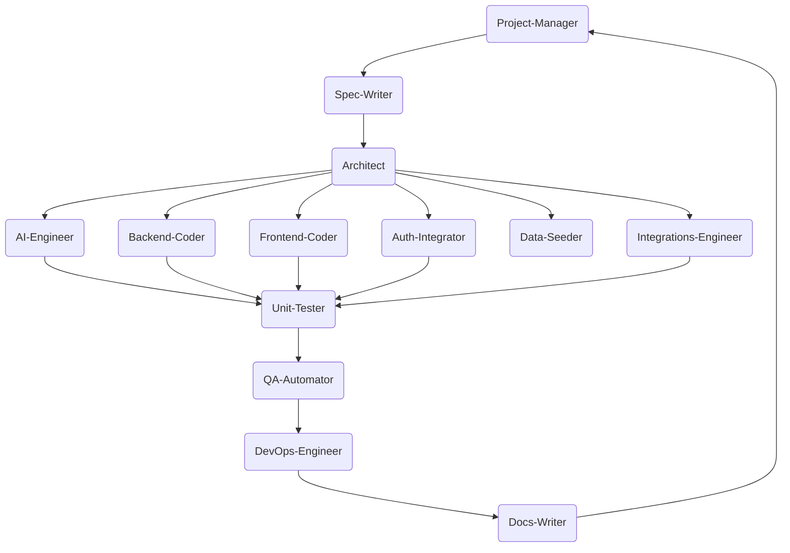

# AGENTS.md – **POD Automator AI**

> **Status:** Full Specification v1.0 – compiled **July 21 2025** from the *POD development prompt* (see `POD.md`), uploaded demo code, and market research.  This file supersedes all prior scaffolds.  It is the **authoritative contract** for every ChatGPT Codex agent operating in the `pod` monorepo.  Amendments require a PR approved by the **Project‑Manager** agent.

---

## 📑 Table of Contents

1. [Purpose & Vision](#1-purpose--vision)
2. [Objectives & Success Criteria](#2-objectives--success-criteria)
3. [Scope](#3-scope)
4. [Personas & Problem Statements](#4-personas--problem-statements)
5. [Competitive Gap Analysis](#5-competitive-gap-analysis)
6. [Architectural Foundations](#6-architectural-foundations)
7. [Execution Graph](#7-execution-graph)
8. [Global Conventions](#8-global-conventions)
9. [Multi‑Agent Directory](#9-multi-agent-directory)
10. [Detailed Agent Specs](#10-detailed-agent-specs)
11. [MVP Feature Matrix](#11-mvp-feature-matrix)
12. [12‑Month Roadmap](#12-12-month-roadmap)
13. [Technical Debt Register](#13-technical-debt-register)
14. [Compliance & Privacy](#14-compliance--privacy)
15. [Observability & SRE Playbook](#15-observability--sre-playbook)
16. [Marketing & Growth Strategy](#16-marketing--growth-strategy)
17. [Definition of Done](#17-definition-of-done)
18. [Appendices](#18-appendices)

---

## 1 | Purpose & Vision

> **Mission:** Deliver a **fully‑automated print‑on‑demand platform** for Etsy sellers.  The system ingests live trend signals from social media and Etsy, distils profitable product ideas via GPT‑4o, generates high‑resolution mock‑ups with `gpt‑image‑1`, pushes SKUs to Printify, and publishes optimised Etsy listings from a single dashboard.

Success will be measured by:

- **User Impact KPIs:**
  - Time‑to‑market from trend scan → live listing **< 15 minutes**.
  - ≥ 99 % job success rate with auto‑retry within 5 minutes.
  - Seller retention ≥ 45 % at day 7.
- **Business KPIs:**
  - Monthly recurring revenue ≥ USD 100 k within 12 months.
  - Gross margin ≥ 70 % after API costs.
- **Technical KPIs:**
  - P95 API latency < 300 ms, frontend CLS < 0.1.
  - 99.95 % uptime across all micro‑services.

---

## 2 | Objectives & Success Criteria

| Objective                    | KPI / Definition of Done                             |
| ---------------------------- | ---------------------------------------------------- |
| Reduce seller time‑to‑market | < 15 min from trend scan → live listing             |
| Reliability                  | ≥ 99 % job success, auto‑retry w/in 5 min           |
| Monetisation                 | Launch tiered Stripe billing with seat‑based limits |
| Scalability                  | Handle 10 000 daily image jobs / 2 000 concurrent users |
| Compliance                   | Adhere to Etsy, Printify, OpenAI Image usage, GDPR  |

---

## 3 | Scope

### 3.1 Technical

| Layer                | Tech / Service                                                       | Notes                                               |
| -------------------- | -------------------------------------------------------------------- | --------------------------------------------------- |
| **🖥 Front‑end**     | React 18 + Next.js 14, Tailwind CSS 3, TypeScript 5                  | PWA dashboard, WebSockets for job status            |
| **⚙️ Back‑end**      | FastAPI 0.110, async PostgreSQL via SQLModel, Redis+Celery           | Decomposed micro‑services (Scraper, Ideation, Image) |
| **🔐 Auth**          | OAuth 2 PKCE with Etsy & Printify; Keycloak or Auth0 for platform    | RBAC roles: owner, editor                            |
| **🤖 AI**            | GPT‑4o for idea generation; gpt‑image‑1 for mock‑ups                 | Prompt templates versioned in `/packages/ai/prompts` |
| **📊 Data**          | TimescaleDB for trend signals; S3/MinIO for images                   | Scalable storage                                     |
| **🛒 Integrations**  | Etsy v3 API, Printify REST API, Stripe Billing API                   | Rate‑limited wrappers                                |
| **☁ Infra**         | GitHub Actions CI/CD, Docker Compose (dev), Helm‑K8s (prod), Grafana | Blue‑green deploy, HPA (0‑10 pods)                  |

### 3.2 Operational

- **Agent‑orchestrated development** – tasks delegated to specialist agents.
- **Dev → Staging → Prod** promotion via branch protections & environment gates.
- **Support & Success** – Intercom integration for onboarding support; Chatbot for Tier‑0 FAQs.

### 3.3 Business

- **Revenue Streams:** freemium subscription, image credit upsells, listing commission, plugin marketplace.
- **Markets:** start with US Etsy sellers; architecture is multi‑tenant and i18n‑ready.

---

## 4 | Personas & Problem Statements

| Persona              | “Jobs‑To‑Be‑Done”                                             | Pains                                      | Gains Desired                          |
| -------------------- | -------------------------------------------------------------- | ------------------------------------------ | -------------------------------------- |
| **Side‑Hustle Seller** | “Launch trending POD products quickly without design skills.” | overwhelmed by trends, limited time         | one‑click trend→listing, auto‑design   |
| **Niche Designer**     | “Test niche art styles on Etsy without manual mock‑up work.”  | hours in Photoshop, uncertain demand        | AI‑assisted design, risk‑free testing   |
| **Social Influencer**  | “Monetise social memes through merch drops immediately.”      | trends decay fast, multi‑platform juggling  | real‑time trend scraping, scheduled drops |
| **Agency Owner**       | “Operate multiple client shops with team workflows.”          | team coordination, manual exports           | multi‑shop dashboard, roles & billing  |

---

## 5 | Competitive Gap Analysis

Competitors include generic POD automation tools and listing managers.  Many support Printful/Printify SKU creation but **lack AI‑driven trend ideation and mock‑ups**.  Few provide unified social trend scraping or automated Etsy listing creation.  Our differentiators:

| Capability               | Existing Tools                   | POD Automator AI (Target)                                | Delta Strategy                              |
| ------------------------ | -------------------------------- | -------------------------------------------------------- | ------------------------------------------- |
| Trend Insight            | Manual keyword entry             | **AI‑powered social & Etsy trend detection**              | multi‑source scraper + GPT clustering       |
| Idea & Mock‑up           | User designs in Canva            | **GPT‑generated briefs & gpt‑image‑1 mock‑ups**           | prompt templates, style parameters          |
| SKU & Listing Publishing | Only Printify export             | **Auto‑create SKUs & Etsy drafts, A/B listing copy**      | API wrappers, templated SEO fields          |
| Team & Billing           | Single account                   | **Org & seat management; Stripe billing**                 | RBAC, tiered quotas                        |
| Observability            | Little transparency              | **Job dashboards, retry & alert system**                  | Celery+Prometheus+Sentry                   |

---

## 6 | Architectural Foundations

Our architecture follows a micro‑services pattern with clear bounded contexts.  High‑level components:

1. **Frontend:** Next.js SPA with WebSockets for real‑time job updates; protected pages via OAuth.
2. **Gateway API:** FastAPI service that exposes GraphQL and REST endpoints; handles auth tokens and rate limiting.
3. **Trend Scraper:** A service using Playwright/Requests to fetch trending hashtags from TikTok, Instagram, Twitter, LinkedIn, Reddit, and Facebook; caches results in TimescaleDB.
4. **Ideation Service:** GPT‑4o function‑calling to cluster trends into product briefs; generates titles, styles and descriptions.
5. **Image Gen Service:** wrapper around OpenAI `gpt‑image‑1` with prompt templating, style parameters, DPI settings; creates both transparent and mocked images.
6. **Integration Service:** connectors for Printify and Etsy to create products, variants, and listings; manages OAuth tokens and rate limits.
7. **Job Queue:** Redis+Celery for asynchronous tasks and retries; backoff strategies.
8. **Database:** PostgreSQL/TimescaleDB core with PGVector for embeddings; S3/Blob storage for image assets.
9. **Secrets & Config:** HashiCorp Vault or AWS Secrets Manager; environment variables loaded via `.env`.
10. **Observability:** Grafana+Prometheus for metrics; Sentry for error tracking; Loki for logs.

---

## 7 | Execution Graph

> **Merge Policy:** only the **Project‑Manager Agent** may merge to `main` when all child agents report SUCCESS and CI is green.

---

## 8 | Global Conventions

1. **Branch Naming:** `agent/<handle>/<issue-id>-<slug>` (e.g. `agent/backend/42-add-printify-client`).
2. **Commits:** follow Conventional Commits (`feat(api): add printify SKU endpoint`).
3. **Environment Variables:** defined in `/env.example`; secrets loaded via AWS SM or Vault.
4. **CI Gates:** pre‑commit runs Black & isort (Python) or ESLint & Prettier (TS); unit coverage ≥ 90 %; integration tests green; Snyk critical issues = 0.
5. **Docker:** multi‑stage builds; image size < 300 MB; SBOM generated.
6. **Docs:** each PR updates relevant markdown or `/docs/changelog.md`.
7. **`AGENTS.md` Usage:** this file is the primary source of truth for Codex; subordinate `agents_*.md` files define specialist behaviours.  Keep these docs up‑to‑date so Codex can follow project rules【172806919470624†L108-L122】.  When programmatic checks (tests/linters) are defined, Codex MUST run them and ensure they pass before committing【172806919470624†L108-L122】.

---

## 9 | Multi‑Agent Directory

| #  | Agent ID               | Role Mandate                                                                     | Inputs                                    | Outputs                                                  | Primary KPIs                       | Escalation               |
| -- | ---------------------- | -------------------------------------------------------------------------------- | ----------------------------------------- | -------------------------------------------------------- | --------------------------------- | ------------------------ |
| 1  | **Project‑Manager**    | Break features into tasks, orchestrate agents, merge PRs                         | GitHub issues, roadmap                    | `planning.md`, merged PRs                              | Cycle‑time < 15 min                 | Architect → CTO          |
| 2  | **Spec‑Writer**        | Convert requests to Gherkin feature files                                         | roadmap, personas                        | `specs/*.feature` and rationale docs                   | 100 % story coverage               | PM                        |
| 3  | **Architect**          | Design high‑level architecture, OpenAPI, DB schema                                | specs                                   | `docs/ARCHITECTURE.md`, `openapi.yaml`, schema files  | 0 OpenAPI lint errors             | PM                        |
| 4  | **Backend‑Coder**      | Implement FastAPI services and business logic                                     | openapi, DB schema, prompts              | `services/**`, tests, docs                           | Route coverage ≥ 95 %             | Architect                 |
| 5  | **Frontend‑Coder**     | Build Next.js dashboard & PWA                                                      | Figma designs, OpenAPI types            | `apps/web/**`                                           | Lighthouse PWA ≥ 90                | PM                        |
| 6  | **Auth‑Integrator**    | Configure OAuth (Etsy, Printify) & platform RBAC                                  | OAuth docs, Keycloak config             | auth hooks, FastAPI auth plugin                       | Login success ≥ 99 %               | Architect                 |
| 7  | **AI‑Engineer**        | Define prompts and call GPT models for idea & mock‑up generation                 | dataset seeds, OpenAI API key           | `packages/ai/**`, eval reports                        | BLEU ≥ 0.8, image quality OK        | Backend‑Coder             |
| 8  | **Data‑Seeder**        | Ingest and refresh trend signals & seed demos                                     | scraper functions, APIs                 | ETL scripts, DB seeds                                 | 100 % trending sources scraped      | PM                        |
| 9  | **Integrations‑Engineer** | Implement Printify & Etsy API clients, handle SKUs & listings                    | API keys, schemas                       | connectors under `packages/integrations/**`          | Checkout/listing success ≥ 95 %    | Backend‑Coder             |
| 10 | **Unit‑Tester**        | Write unit/integration tests for all services & packages                          | diffs, feature specs                    | `tests/**`, coverage reports                          | Global coverage ≥ 90 %             | PM                        |
| 11 | **QA‑Automator**       | Create Playwright & performance tests, visual regression                          | preview URL                             | e2e specs, a11y reports, lighthouse reports          | E2E pass rate ≥ 98 %               | PM                        |
| 12 | **DevOps‑Engineer**    | Maintain CI/CD pipeline, Helm charts, Terraform, observability                   | infra templates, SLO definitions        | `.github/workflows/**`, `infra/**`, cost reports      | Deployment success ≥ 99 %          | CTO                       |
| 13 | **Docs‑Writer**        | Produce user & technical docs, release notes, marketing copy                     | codebase, legal docs                    | `/docs/**`, `/public/privacy.html`, blog posts        | Docs coverage 100 %                | PM                        |

*(Future roles such as “Marketing‑Strategist” or “Growth‑Hacker” may be added in `agents.marketing.md` as needed.)*

---

## 10 | Detailed Agent Specs

Each specialist agent has a dedicated markdown file in `/pod_agents/` describing its system prompt, responsibilities, inputs, outputs, KPIs, failure handling, and standing assumptions.  These files mirror the structure used in `AGENTS.md` and ensure that Codex can operate each role autonomously.  See for example `agents_backend_coder.md` for the backend role.

---

## 11 | MVP Feature Matrix

| Feature                        | Requirement                                                         | Owner Agent(s)                      | Acceptance Criteria                                             |
| ------------------------------ | ------------------------------------------------------------------- | ----------------------------------- | ------------------------------------------------------------- |
| **Trend Scraper**              | Gather top trending keywords from TikTok, Instagram, Twitter, etc.   | Data‑Seeder                         | Returns ≥ 50 unique keywords per scan; ≤ 5 % scrape failures    |
| **Idea Generation**            | Generate creative briefs from keywords via GPT‑4o                   | AI‑Engineer, Backend‑Coder          | JSON brief matches schema; BLEU vs curated ideas ≥ 0.8          |
| **Mock‑up Creation**           | Use gpt‑image‑1 to generate 4K PNG mock‑ups                         | AI‑Engineer, Integrations‑Engineer  | 1024×1024 images saved; DPI 300; passes OpenAI content filters  |
| **Printify SKU Creation**      | Create product variants via Printify API                             | Integrations‑Engineer               | SKU ID returned; product published; error rate < 2 %            |
| **Etsy Listing Publisher**     | Publish draft listings with SEO tags and A/B copy                   | Integrations‑Engineer               | Listing appears in Etsy shop; titles within 140 chars          |
| **Dashboard Frontend**         | Next.js SPA with Kanban board (“Signals”→“Ideas”→“Ready”→“Live”)    | Frontend‑Coder, Auth‑Integrator     | All components responsive; Lighthouse score ≥ 90                |
| **User & Org Management**      | OAuth login, seat management, plan enforcement                      | Auth‑Integrator, Backend‑Coder      | Quota middleware returns 402 when exceeded                       |
| **Billing & Quotas**           | Stripe portal, per‑seat billing, image credit management            | Integrations‑Engineer, DevOps       | Billing events recorded; overage charges appear in invoices      |
| **Observability & Alerts**     | Grafana dashboards, Prometheus metrics, Sentry alerts               | DevOps‑Engineer                     | Alert triggered on error budget burn; dashboards show p95 latency |
| **CI/CD Pipeline**             | Build, test, deploy to staging & prod via blue‑green strategy       | DevOps‑Engineer                     | `main` merges auto‑deploy; zero‑downtime releases               |
| **Documentation & Onboarding** | Setup guide, API docs, user tutorials                               | Docs‑Writer                         | Docs accessible; onboarding wizard flows pass unit tests        |

---

## 12 | 12‑Month Roadmap

### Phase 0 (M0‑M3) – **MVP Launch**

- Implement trend scraper, ideation, image generation, Printify integration, Etsy listing, dashboard, OAuth & Stripe billing.
- Deploy to staging & run closed beta.

### Phase 1 (M4‑M6) – **Stabilise & Enhance**

- Burn down bug backlog, refine UI/UX, improve scraping reliability.
- Add scheduled drops, A/B optimisation, and social‑post generator.

### Phase 2 (M7‑M9) – **Scale & Collaborate**

- Introduce agency workspaces, role‑based permissions, team analytics.
- Add marketplace for community prompt packs; integrate additional POD providers.

### Phase 3 (M10‑M12) – **Monetise & Expand**

- Launch premium tiers, advanced analytics, dynamic pricing advisor.
- Explore expansion to other marketplaces (e.g. Shopify, Amazon Merch).

---

## 13 | Technical Debt Register

| ID   | Description                              | Linked Issue | Priority | Assigned Agent           |
| ---- | ---------------------------------------- | ------------ | -------- | ------------------------ |
| TD‑01 | Replace in‑memory scraper cache with Timescale continuous aggregates | #12         | High     | Data‑Seeder              |
| TD‑02 | Add comprehensive error handling around Printify API responses      | #27         | Medium   | Integrations‑Engineer    |
| TD‑03 | Improve IDE prompting to reduce hallucinations in descriptions       | #34         | Medium   | AI‑Engineer              |
| TD‑04 | Pagination missing on trend signals API                             | N/A         | Low      | Backend‑Coder            |

---

## 14 | Compliance & Privacy

- **GDPR & CCPA:** allow users to export and delete their data; store PII encrypted at rest; anonymise logs after 30 days.
- **Content Policy:** follow OpenAI image content guidelines; filter disallowed prompts before calling `gpt‑image‑1`.
- **Platform Terms:** abide by Etsy & Printify API terms; do not resell images outside permitted use.
- **Security:** rotate OAuth tokens regularly; implement least‑privilege RBAC; store refresh tokens encrypted.

---

## 15 | Observability & SRE Playbook

- **Metrics:** instrument services with Prometheus counters & histograms; track job durations, error rates, API latency.
- **Logging:** use structured logging (pino for Node services, loguru for Python); stream to Loki with 30 day retention.
- **Tracing:** propagate trace IDs across services using OpenTelemetry; sample 10 % of requests.
- **Alerts:** define error budget policies; use PagerDuty for on‑call rotations; SLO breaches trigger escalation.
- **Runbooks:** store runbooks under `/docs/SRE/` including playbooks for scraper outages, Printify rate‑limit errors, and Etsy auth failures.

---

## 16 | Marketing & Growth Strategy

| Channel            | Strategy                                   | KPI                  | Owner                           |
| ------------------ | ------------------------------------------- | -------------------- | ------------------------------- |
| SEO & Blog         | Publish content on trend analysis & POD tips | organic sessions     | Docs‑Writer + Marketing         |
| Social Media       | Share success stories & behind‑the‑scenes   | follower growth      | Docs‑Writer + Growth‑Hacker      |
| Influencer Program | Recruit top Etsy sellers for beta feedback   | new sign‑ups         | Project‑Manager                |
| Referral           | “Give 5 free images, Get 5” programme        | referral rate        | PM                             |
| Email Drip         | Weekly tips & new feature announcements      | open rate ≥ 40 %     | Docs‑Writer                    |

---

## 17 | Definition of Done

A feature or pull request is DONE when:

1. The corresponding story in the GitHub Project board is moved to **Done**.
2. All automated checks pass: unit tests, integration tests, e2e tests, lint, vulnerability scans.
3. Documentation, tests, and changelog are updated.
4. Deployment to **staging** completes successfully and smoke tests pass.
5. **Project‑Manager Agent** merges to `main` and tags the release.

---

## 18 | Appendices

- **A.** *POD Development Prompt* (POD.md) – parsed reference for system requirements.
- **B.** Glossary – definitions for trend, brief, SKU, listing, etc.
- **C.** External API Docs index – links to Etsy v3, Printify, Stripe, OpenAI images.

---

> **End of AGENTS.md v1.0 – subsequent edits must follow the agent process.**
