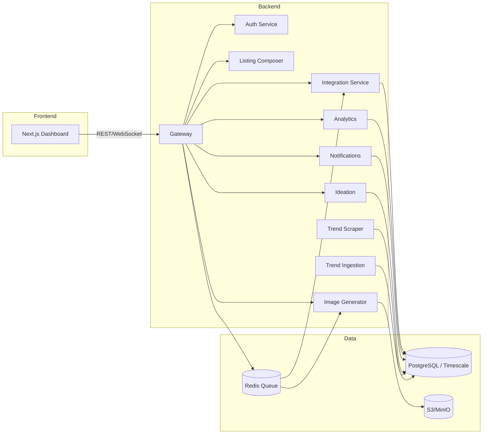

# System Architecture

This document summarises the POD Automator AI platform at a high level.

## High-Level Overview

## Service Responsibilities

| Service | Key Responsibilities |
| ------- | -------------------- |
| Gateway | BFF exposing REST endpoints, orchestrates generation workflows, mounts child apps |
| Auth | OAuth login/session management, refresh scheduling |
| Trend Scraper | Pulls curated datasets and legacy trend lists |
| Trend Ingestion | Live Playwright scraping, categorisation, persistence |
| Ideation | GPT-driven idea generation and tag suggestions |
| Image Generator | gpt-image-1 rendering, asset storage |
| Notifications | Scheduler jobs, email/push stubs, scheduled notifications |
| Listing Composer | Draft and tag management |
| Analytics | Event logging, metrics aggregation |
| Integration | Printify/Etsy/Stripe connectors |

## Data Stores

- **PostgreSQL/Timescale** for relational data, OAuth credentials, analytics events.
- **Redis** for Celery queues and rate limiting state.
- **S3/MinIO** for generated assets.

## Deployment Pipeline

1. GitHub Actions runs lint, pytest, frontend tests, Playwright, and Alembic upgrade check.
2. Images are built via Docker and published.
3. Helm deploys to Kubernetes with blue/green strategy.

## Observability

- Prometheus scrapes `/metrics`; Grafana dashboards monitor latency and job success.
- Sentry captures FastAPI exceptions; log output is JSON via structlog.

Refer to `docs/migrations.md` and `docs/observability.md` for detailed operational guidance.

