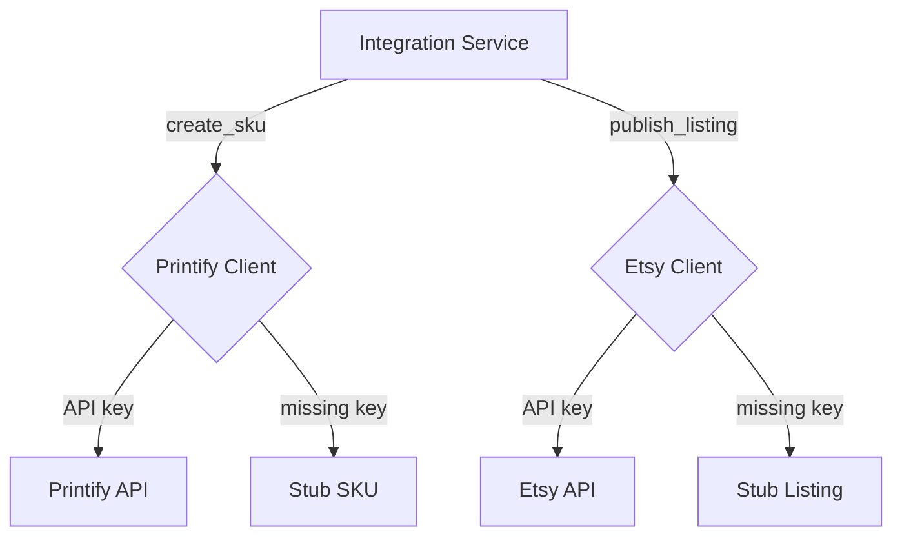

# Integrations Architecture

The integration service delegates to dedicated clients for Printify and Etsy. Each client reads its API key from environment variables and falls back to stubbed responses when keys are absent.

