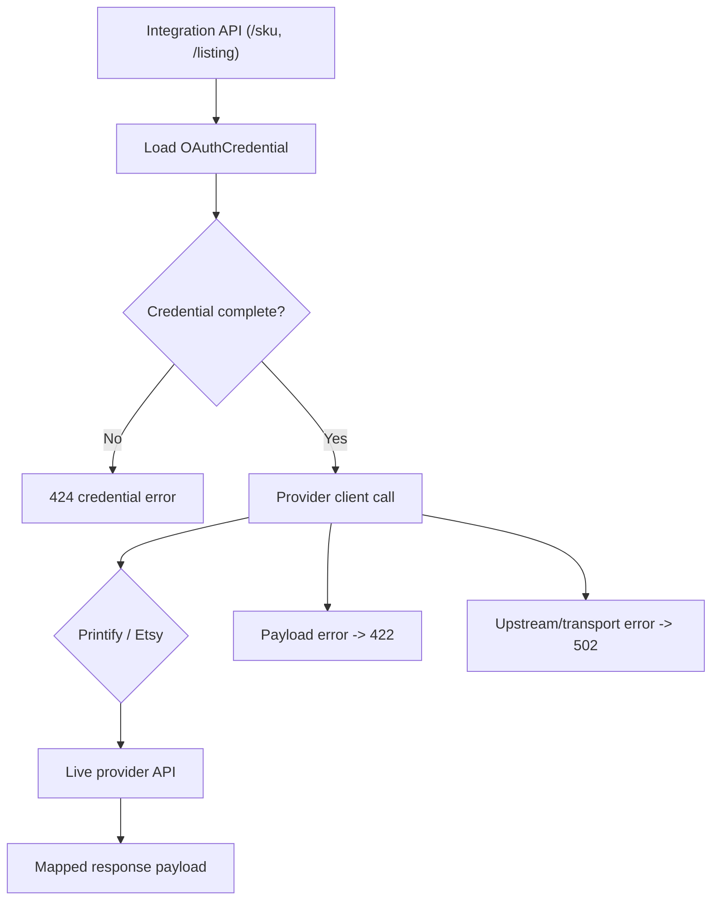

# Integrations Architecture

The integration service delegates to dedicated clients for Printify and Etsy.
At runtime, `/sku` and `/listing` load per-user OAuth credentials from
`OAuthCredential` and pass those to provider clients with `require_live=True`.
Service-level errors are normalized to explicit HTTP contracts:

- `424`: missing/incomplete OAuth credentials
- `422`: invalid product/listing payload
- `502`: provider upstream or transport failures

```mermaid
flowchart TD
    A["Integration API (/sku, /listing)"] --> B["Load OAuthCredential"]
    B --> C{Credential complete?}
    C -->|No| D["424 credential error"]
    C -->|Yes| E["Provider client call"]
    E --> F{"Printify / Etsy"}
    F --> G["Live provider API"]
    G --> H["Mapped response payload"]
    E --> I["Payload error -> 422"]
    E --> J["Upstream/transport error -> 502"]
```
