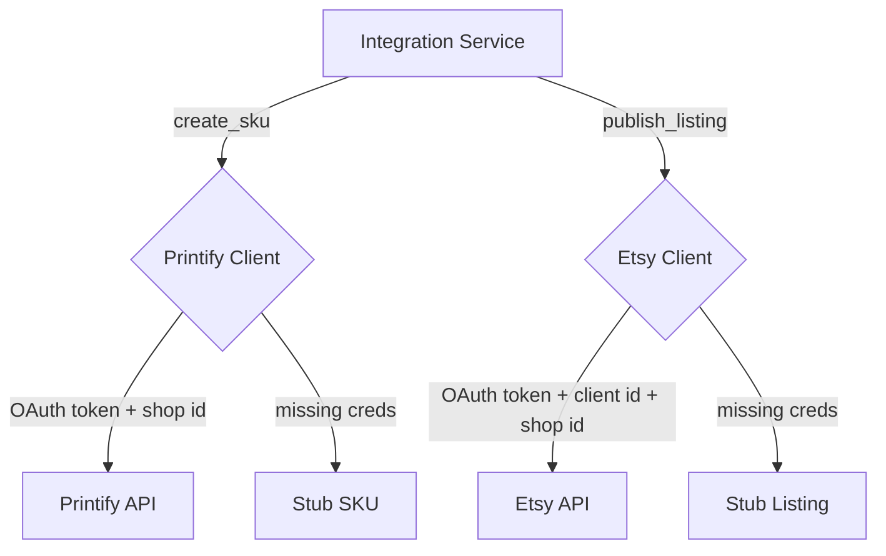

# Integrations Architecture

The integration service delegates to dedicated clients for Printify and Etsy.
Each client resolves credentials in this precedence order: persisted OAuth credentials
for the requesting user, then environment fallback values for local/staging operation.
When required credentials are absent, the client returns deterministic stub responses.

Runtime reliability contract:
- Real API calls raise a `RuntimeError` with provider name, HTTP status, and parsed
  upstream error detail when available.
- Transport failures raise a `RuntimeError` with provider name and transport class.
- Stub mode is only used when credentials are missing, not when an upstream call fails.

```mermaid
flowchart TD
    A[Integration Service] -->|create_sku| B{Printify Client}
    B -->|OAuth token + shop id| C[Printify API]
    B -->|missing creds| D[Stub SKU]
    A -->|publish_listing| E{Etsy Client}
    E -->|OAuth token + client id + shop id| F[Etsy API]
    E -->|missing creds| G[Stub Listing]
```
