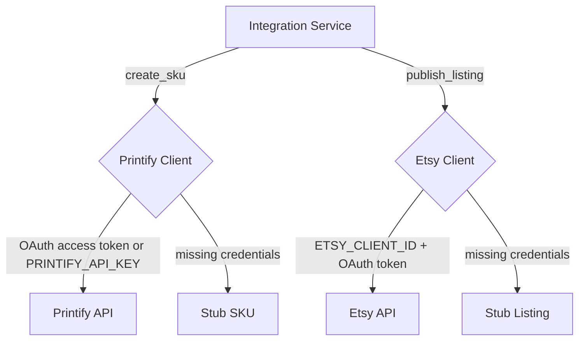

# Integrations Architecture

The integration service delegates to dedicated clients for Printify and Etsy. Runtime listing calls use stored OAuth access tokens when available, while Etsy requests require an app `ETSY_CLIENT_ID` for request signing. Missing credentials fall back to stubbed responses for local development.

```mermaid
flowchart TD
    A[Integration Service] -->|create_sku| B{Printify Client}
    B -->|OAuth access token or PRINTIFY_API_KEY| C[Printify API]
    B -->|missing credentials| D[Stub SKU]
    A -->|publish_listing| E{Etsy Client}
    E -->|ETSY_CLIENT_ID + OAuth token| F[Etsy API]
    E -->|missing credentials| G[Stub Listing]
```
