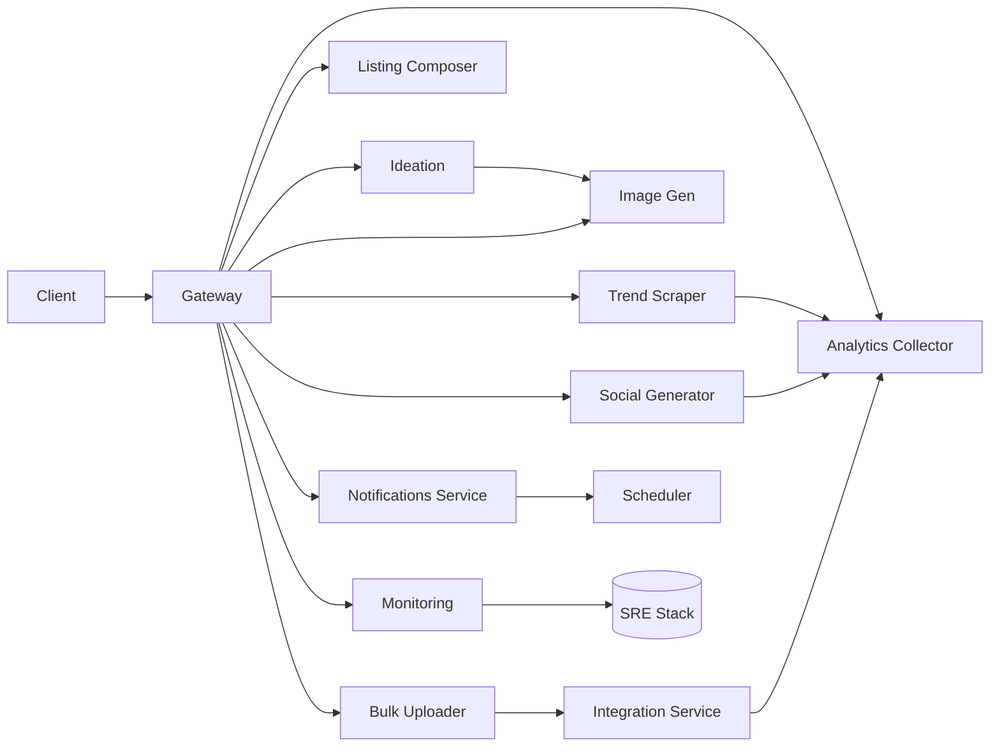
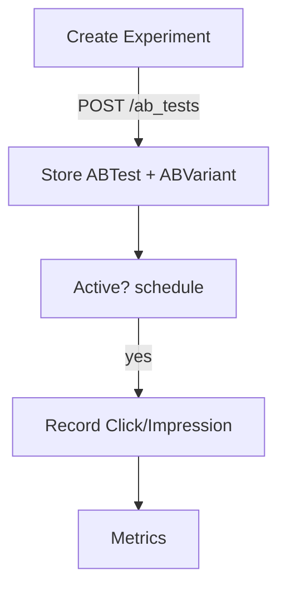

# Internal Documentation

## Feature Overview

| Feature | Completed |
| --- | --- |
| Advanced search and filtering | 2025-07-21 |
| A/B testing engine v3 | 2025-07-21 |
| Analytics enhancements | 2025-07-21 |
| Listing composer enhancements | 2025-07-21 |
| Social media generator | 2025-07-21 |
| Bulk product creation | 2025-07-21 |
| Real integrations | 2025-07-21 |
| Monitoring and notifications | 2025-07-21 |
| Localization | 2025-07-21 |

## Architecture Overview



The gateway routes requests to individual microservices. Each service emits analytics events and exposes health, readiness and metrics endpoints consumed by the monitoring stack.

The full OpenAPI specification is auto-generated from the gateway and stored in [`openapi.yaml`](../openapi.yaml). FastAPI also serves an interactive Swagger UI at `/docs` and the JSON spec at `/openapi.json`.

## Testing & QA Strategy

Quality assurance combines unit, integration and browser tests.

- **Unit tests** live in `tests/` and cover services such as search, A/B testing, listing composer, bulk upload and analytics. Use `pytest` for backend code and `jest` for frontend modules. Keep tests deterministic by seeding the in-memory SQLite database and mocking any external requests.
- **End-to-end tests** reside in `tests/e2e/` and are written with Playwright. They simulate creating listings, uploading bulk products and running experiments. Playwright browsers are installed via `npx playwright install --with-deps`; if browsers are unavailable the suite is skipped.
- **Running locally**:

```bash
pip install -r requirements.txt
pytest
npm ci --prefix client
npm test --prefix client
npx playwright install --with-deps
npx playwright test
```

Roles from `agents.md`:

- **QA‑Automator** – maintains end-to-end scenarios and CI reliability.
- **Unit‑Tester** – expands service level coverage and mocks integrations.

## Real Integrations

Real Printify and Etsy clients live in `packages/integrations/printify.py` and `packages/integrations/etsy.py`. They load API keys from environment variables and fall back to stubbed responses when keys are missing, logging the fallback. The integration service interacts with the bulk uploader and listing composer to persist SKUs and publish listings.

## Bulk Product Creation

`POST /api/bulk_create` accepts a CSV or JSON list of product definitions. Each item is validated and persisted via the integration service. The response summarises created products and per-item errors.

Sample CSV:

```csv
title,description,price,category,variants,image_urls
"Shirt","Cool shirt",19.99,apparel,"[{""sku"":""s1"",""price"":19.99}]","[""http://example.com/img.png""]"
```

Sample JSON:

```json
[
  {
    "title": "Shirt",
    "description": "Cool shirt",
    "price": 19.99,
    "category": "apparel",
    "variants": [{"sku": "s1", "price": 19.99}],
    "image_urls": ["http://example.com/img.png"]
  }
]
```

Response:

```json
{ "created": [...], "errors": [{ "index": 1, "error": "detail" }] }
```

## Social Media Generator Service

The `social_generator` service builds captions and optional images for social posts without external APIs. It combines product metadata with language-specific templates and trending keywords loaded from configuration files.

### API

- **POST `/api/social/generate`**
  - Body: `{ product_id?, title?, description?, tags?, product_type?, language?, include_image? }`
  - Response: `{ "caption": string, "image": base64 | null }`

If `product_id` is supplied, metadata is looked up from an internal store. Templates and keywords are localised using files in `services/social_generator/templates/` and `client/locales/*`.

## Listing Composer Enhancements

The `ideation` service exposes a tag suggestion helper for Etsy listings. It inspects the listing title and description and returns up to 13 concise tags.

### Tag Suggestion API

- **POST `/api/ideation/suggest-tags`**
  - Body: `{ "title": string, "description": string }`
  - Response: `string[]` of tag suggestions ranked by historical sales and search frequency.

### Draft API

- **POST `/api/listing-composer/drafts`** – save or update a draft. Body includes `title`, `description`, `tags`, `language` and `field_order`.
- **GET `/api/listing-composer/drafts/{id}`** – fetch a previously saved draft.

The `/listings` page renders the `ListingComposer` component. Users type a title and description, see character counters in real time, reorder fields via drag-and-drop, save drafts and compose listings in multiple languages.

## Analytics Enhancements

The analytics module records user interactions and exposes aggregated metrics for the dashboard.

### Components

- **Model**: `AnalyticsEvent` in `services/models.py` stores `event_type`, `path`, optional `user_id` and `metadata`.
- **API** (`services/analytics/api.py`):
  - `POST /analytics/events` – record an event.
  - `GET /analytics/events` – list events by type.
  - `GET /analytics/summary` – aggregate counts and conversion rates per path.
- **Middleware**: `AnalyticsMiddleware` attaches to FastAPI apps and logs `page_view` events asynchronously to keep p95 latency under 300 ms.

Stored events are aggregated via `/analytics/summary` and rendered in dashboard charts. Conversion events trigger an async usage report to Stripe for billing (skipped when `STRIPE_API_KEY` is absent).

## Advanced Search & Filtering

The `search` service exposes a `/api/search` endpoint supporting keyword, category, tag and rating filters. Queries are translated into SQL so filtering and pagination occur at the database layer. The endpoint returns `{ items, total, page, page_size }` allowing the UI to display result counts and paginate efficiently. The `/search` page consumes this endpoint and the navbar includes a quick search box that routes to the page.

## A/B Testing Engine v3

The `ab_tests` service manages experiments defined by an `ABTest` record and one or more `ABVariant` rows. Each test stores the experiment type (`image`, `description` or `price`), optional start and end times for scheduling, and variants with explicit traffic weights.



During creation, weights are validated to sum to 1. When a click or impression arrives, the service checks the schedule before incrementing counters. Metrics endpoints combine test and variant data to report conversion rates and weight distribution.

## Notifications Service

The notifications module stores user-facing alerts and schedules recurring messages.

- **GET `/api/notifications`** – list notifications for the user (requires `X-User-Id` header).
- **POST `/api/notifications`** – create a notification. Body: `{ message: string, type?: string, user_id?: int }`.
- **PUT `/api/notifications/{id}/read`** – mark a notification as read.

A background scheduler triggers monthly quota reset and weekly trend summary jobs. Delivery stubs exist for email and push channels.

## Monitoring & Health

Every service exposes:

- **GET `/health`** – liveness probe.
- **GET `/ready`** – readiness probe verifying downstream dependencies.
- **GET `/metrics`** – Prometheus-formatted metrics.

These endpoints feed the observability stack and support alerting defined in the SRE playbook. Refer to [AGENTS.md §15](../agents.md#15-observability--sre-playbook) for operational guidelines.

## Localization

The frontend uses **next-i18next** for translations. Language files reside under `client/locales/<lang>/common.json`. To add a new language, duplicate the `en` folder, translate keys, add the code to `locales` in `client/next-i18next.config.js` and restart the frontend. See [localization docs](./localization.md) for details.

## API Reference

### Search Filtering

**GET `/api/search`**

- Query: `q`, `category?`, `tag?`, `rating?`, `page?`, `page_size?`
- Response:

```json
{ "items": [], "total": 0, "page": 1, "page_size": 25 }
```

Example:

```bash
curl '/api/search?q=cat&category=apparel'
```

### A/B Testing

**POST `/ab_tests`** – create experiment.

```json
{ "name": "Image test", "type": "image", "variants": [{"name": "A", "weight": 0.5}, {"name": "B", "weight": 0.5}] }
```

**GET `/ab_tests/{id}`** – fetch experiment.

**POST `/ab_tests/{id}/events`** – record `click` or `impression`.

### Analytics Events

**POST `/analytics/events`**

```json
{ "event_type": "page_view", "path": "/dashboard" }
```

**GET `/analytics/summary`** – aggregated metrics.

### Bulk Product Creation Endpoint

**POST `/api/bulk_create`** – see sample above. Returns list of created products and per-item errors.

### Social Generator

**POST `/api/social/generate`** – generate caption and optional image.

### Notifications

**GET `/api/notifications`** – list notifications.

**POST `/api/notifications`** – create notification.

**PUT `/api/notifications/{id}/read`** – mark read.

### Monitoring

**GET `/health`**, **GET `/ready`**, **GET `/metrics`** – health and metrics endpoints for each service.

## Agent Responsibilities

Implementation and maintenance follow the roles in [agents.md](../agents.md):

- **Backend_Coder** implements and tests the REST endpoints defined above.
- **Frontend_Coder** consumes these APIs in the dashboard and keeps the UI synchronised.
- **SRE Playbook** (AGENTS.md §15) governs monitoring, metrics collection and alerting for the exposed health endpoints.

