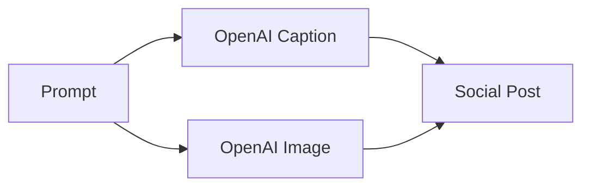

# Internal Documentation

## Social Media Generator Service

The `social_generator` service provides an endpoint to create social media
content from a text prompt. It returns a marketing caption and an image URL.

### API

- **POST `/social/post`**
  - Body: `{ "prompt": string }`
  - Response: `{ "caption": string, "image_url": string }`

Behind the scenes the service calls the OpenAI integration client. When the
`OPENAI_USE_STUB` environment variable is set or `OPENAI_API_KEY` is missing,
stubbed responses are returned. The integration client implements basic retry
logic for rate limits.

### Flow



The task can also be executed asynchronously via the Celery task
`generate_social_post_task`.

## Frontend Page

The `/social-generator` page renders the `SocialMediaGenerator` component. Users
enter a prompt and the page displays the generated caption and image. The
component uses the shared translation files and the design system classes for a
responsive layout.

# Analytics Service

## Architecture
The analytics module records user interactions and exposes aggregated metrics for the dashboard.

### Components
- **Model**: `AnalyticsEvent` in `services/models.py` stores `event_type`, `path`, optional `user_id` and `metadata`.
- **Model**: `Metric` captures aggregated values (`name`, `value`) for dashboard visualisations.
- **API** (`services/analytics/api.py`):
  - `POST /analytics/events` – record an event.
  - `GET /analytics/events` – list events by type.
  - `GET /analytics/summary` – aggregate counts per path.
  - `POST /analytics/metrics` – store a metric value.
  - `GET /analytics/metrics` – list stored metrics.
- **Middleware**: `AnalyticsMiddleware` attaches to FastAPI apps and logs `page_view` events asynchronously to keep p95 latency under 300 ms.
- **Exporter**: events are forwarded to `EXTERNAL_ANALYTICS_URL` using a rate‑limited connector with retry and error logging.
- **Stripe Usage**: conversion events trigger an async usage report to Stripe for billing (skipped when `STRIPE_API_KEY` is absent).

### Data Flow
1. Requests hit any FastAPI service using `AnalyticsMiddleware`.
2. Middleware schedules a background task to persist the event.
3. Stored events are aggregated via `/analytics/summary` and rendered in the dashboard charts.

## Usage
Mount the middleware on additional services as needed:

```python
from services.analytics.middleware import AnalyticsMiddleware

app.add_middleware(AnalyticsMiddleware)
```
