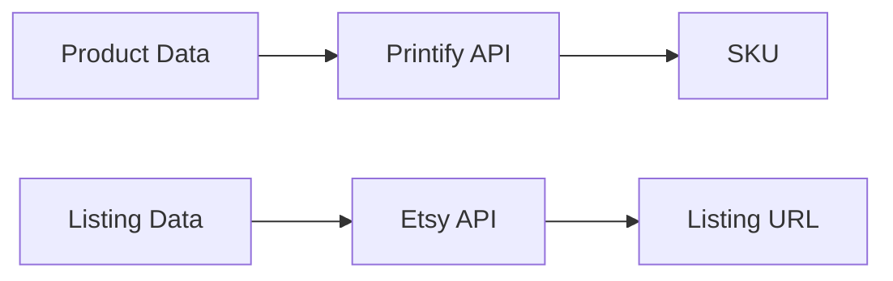
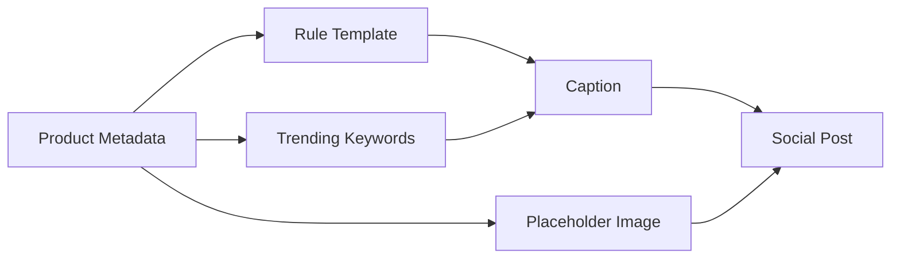
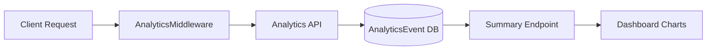
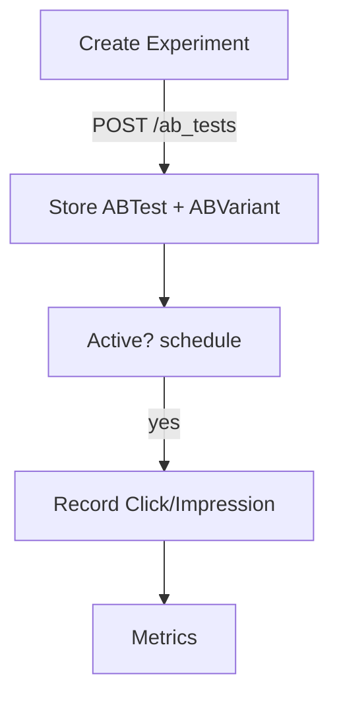

# Internal Documentation

## Testing & QA Strategy

Quality assurance combines unit, integration and browser tests.

- **Unit tests** live in `tests/` and cover services such as search,
  A/B testing, listing composer, bulk upload and analytics. Use
  `pytest` for backend code and `jest` for frontend modules. Keep
  tests deterministic by seeding the in-memory SQLite database and
  mocking any external requests.
- **End-to-end tests** reside in `tests/e2e/` and are written with
  Playwright. They simulate creating listings, uploading bulk products
  and running experiments. Playwright browsers are installed via
  `npx playwright install --with-deps`; if browsers are unavailable the
  suite is skipped.
- **Running locally**:

```bash
pip install -r requirements.txt
pytest
npm ci --prefix client
npm test --prefix client
npx playwright install --with-deps
npx playwright test
```

Roles from `agents.md`:

- **QA‑Automator** – maintains end-to-end scenarios and CI reliability.
- **Unit‑Tester** – expands service level coverage and mocks
  integrations.

## Integration Service

Real Printify and Etsy clients live in `packages/integrations/printify.py` and `packages/integrations/etsy.py`. They load API keys from environment variables and fall back to stubbed responses when keys are missing, logging the fallback.

### Integration Flow



## Bulk Product Creation

`POST /api/bulk_create` accepts a CSV or JSON list of product definitions. Each
item is validated and persisted via the existing Printify integration. The
response summarises created products and per-item errors.

Sample CSV:

```
title,description,price,category,variants,image_urls
"Shirt","Cool shirt",19.99,apparel,"[{""sku"":""s1"",""price"":19.99}]","[""http://example.com/img.png""]"
```

Sample JSON:

```json
[
  {
    "title": "Shirt",
    "description": "Cool shirt",
    "price": 19.99,
    "category": "apparel",
    "variants": [{"sku": "s1", "price": 19.99}],
    "image_urls": ["http://example.com/img.png"]
  }
]
```

Response:

```
{ "created": [...], "errors": [{ "index": 1, "error": "detail" }] }
```

## Notification & Scheduling System

The notification service alerts users about quota resets, trending products and
user-scheduled reminders. It defines two SQLModel tables:

- `Notification` – stores `user_id`, `type` (`quota_reset`, `trending_product`,
  `scheduled_post`), message, `delivery_method` (`email`, `in_app`, `push`),
  `status` (`pending`, `sent`), optional `scheduled_at`, `created_at` and
  `read` flag.
- `NotificationPreference` – per-user delivery preferences for each
  notification type.

An `AsyncIOScheduler` dispatches due notifications every minute and triggers
monthly quota resets plus periodic trend checks. Delivery currently uses stub
functions (`send_email`, `send_push`) that log output; real integrations can
replace them later.

### API

- **POST `/api/notifications/schedule`** – schedule a notification.
- **GET `/api/notifications`** – list notifications with `unread` and
  `status` filters.
- **POST `/api/notifications/mark_read`** – mark a notification as read.
- **POST `/api/notifications/preferences`** – set delivery preferences.

### Frontend

The dashboard navbar shows a bell icon with unread count. The notifications
page lists messages with timestamps and allows marking as read. A `/schedule`
page lets users schedule future posts or reminders. All labels are localised in
English and Spanish.

Backend_Coder owns the service logic and scheduler while Frontend_Coder wires
up React components and translations.

## Social Media Generator Service

The `social_generator` service builds captions and optional images for social
posts without relying on external APIs. It combines product metadata with
language specific templates and trending keywords loaded from a configuration
file.

### API

- **POST `/api/social/generate`**
  - Body: `{ product_id?, title?, description?, tags?, product_type?, language?, include_image? }`
  - Response: `{ "caption": string, "image": base64 | null }`

If `product_id` is supplied, metadata is looked up from an internal store.
Templates and trending keywords are localised using the translation files in
`services/social_generator/templates/` and `client/locales/*`.

### Flow



## Frontend Page

The `/social-generator` page lets sellers enter product details and preview the
generated caption and image. The caption can be edited, copied to the clipboard
and the image downloaded. The feature honours the user's auto-generation and
social handle preferences.

## Listing Composer

The `ideation` service exposes a tag suggestion helper for Etsy listings. It
inspects the listing title and description and returns up to 13 concise tags.

### API

- **POST `/api/ideation/suggest-tags`**
  - Body: `{ "title": string, "description": string }`
  - Response: `string[]` of tag suggestions

### Frontend Page

The `/listings` page renders the `ListingComposer` component. Users type a title
and description, see character counters update in real time and can request tag
suggestions which populate clickable chips for easy selection. Fields can be
reordered via drag-and-drop to match user preference. Drafts may be saved and
resumed, and listings can be composed in multiple languages.

### Draft API

- **POST `/api/listing-composer/drafts`** – save or update a draft. Body
  includes `title`, `description`, `tags`, `language` and `field_order`.
- **GET `/api/listing-composer/drafts/{id}`** – fetch a previously saved draft.

The tag suggestion endpoint now ranks suggestions using historical sales and
search frequency data for improved relevance.
=======
# Analytics Service

## Architecture
The analytics module records user interactions and exposes aggregated metrics for the dashboard.

### Components
- **Model**: `AnalyticsEvent` in `services/models.py` stores `event_type`, `path`, optional `user_id` and `metadata`.
- **API** (`services/analytics/api.py`):
  - `POST /analytics/events` – record an event.
  - `GET /analytics/events` – list events by type.
  - `GET /analytics/summary` – aggregate counts and conversion rates per path.
- **Middleware**: `AnalyticsMiddleware` attaches to FastAPI apps and logs `page_view` events asynchronously to keep p95 latency under 300 ms.
- **Stripe Usage**: conversion events trigger an async usage report to Stripe for billing (skipped when `STRIPE_API_KEY` is absent).

### Architecture Diagram


### Data Flow
1. Requests hit any FastAPI service using `AnalyticsMiddleware`.
2. Middleware schedules a background task to persist the event.
3. Stored events are aggregated via `/analytics/summary` and rendered in the dashboard charts.

## Usage
Mount the middleware on additional services as needed:
```python
from services.analytics.middleware import AnalyticsMiddleware
app.add_middleware(AnalyticsMiddleware)

```

## User Plans and Quotas

The platform tracks usage limits per subscription plan and exposes endpoints
for the dashboard to display remaining credits.

### API

- **GET `/api/user/plan`** – returns `{ plan, quota_used, limit }` and resets
  monthly usage when needed.
- **POST `/api/user/plan`** – increment usage by `count`; returns updated
  `{ plan, quota_used, limit }` or 403 when the quota would be exceeded.

### Frontend

The `QuotaDisplay` component in the dashboard navigation calls the GET endpoint
via a typed client and shows the remaining credits. When fewer than 10 % of
credits remain, the counter turns red to warn the user.

## Advanced Search Service

The `search` service exposes a `/api/search` endpoint supporting keyword,
category, tag and rating filters. Queries are translated into SQL so filtering
and pagination occur at the database layer. The endpoint returns `{ items,
total, page, page_size }` allowing the UI to display result counts and paginate
efficiently.

On the frontend, the `/search` page provides controls for each filter and
consumes the endpoint. The navbar now includes a quick search box which routes
to the page and pre-fills the query parameter.


## A/B Testing Engine

The `ab_tests` service manages experiments defined by an `ABTest` record and one or more `ABVariant` rows. Each test stores the experiment type (`image`, `description` or `price`), optional start and end times for scheduling, and variants with explicit traffic weights.



During creation, weights are validated to sum to 1. When a click or impression arrives, the service checks the current time against the experiment schedule before incrementing counters. Metrics endpoints combine test and variant data to report conversion rates and weight distribution.
