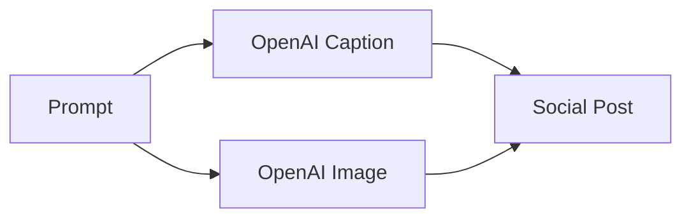

# Internal Documentation

## Integration Service Stubs

Temporary stub implementations live in `services/integration/service.py`. Unit tests in `tests/test_integration_service.py` verify these stubs and should be removed once the real Printify and Etsy clients are integrated.

## Social Media Generator Service

The `social_generator` service provides an endpoint to create social media
content from a text prompt. It returns a marketing caption and an image URL.

### API

- **POST `/social/post`**
  - Body: `{ "prompt": string }`
  - Response: `{ "caption": string, "image_url": string }`

Behind the scenes the service calls the OpenAI integration client. When the
`OPENAI_USE_STUB` environment variable is set or `OPENAI_API_KEY` is missing,
stubbed responses are returned. The integration client implements basic retry
logic for rate limits.

### Flow



The task can also be executed asynchronously via the Celery task
`generate_social_post_task`.

## Frontend Page

The `/social-generator` page renders the `SocialMediaGenerator` component. Users
enter a prompt and the page displays the generated caption and image. The
component uses the shared translation files and the design system classes for a
responsive layout.

## Listing Composer

The `ideation` service exposes a tag suggestion helper for Etsy listings. It
inspects the listing title and description and returns up to 13 concise tags.

### API

- **POST `/api/ideation/suggest-tags`**
  - Body: `{ "title": string, "description": string }`
  - Response: `string[]` of tag suggestions

### Frontend Page

The `/listings` page renders the `ListingComposer` component. Users type a title
and description, see character counters update in real time and can request tag
suggestions which populate clickable chips for easy selection.
=======
# Analytics Service

## Architecture
The analytics module records user interactions and exposes aggregated metrics for the dashboard.

### Components
- **Model**: `AnalyticsEvent` in `services/models.py` stores `event_type`, `path`, optional `user_id` and `metadata`.
- **API** (`services/analytics/api.py`):
  - `POST /analytics/events` – record an event.
  - `GET /analytics/events` – list events by type.
  - `GET /analytics/summary` – aggregate counts per path.
- **Middleware**: `AnalyticsMiddleware` attaches to FastAPI apps and logs `page_view` events asynchronously to keep p95 latency under 300 ms.
- **Stripe Usage**: conversion events trigger an async usage report to Stripe for billing (skipped when `STRIPE_API_KEY` is absent).

### Data Flow
1. Requests hit any FastAPI service using `AnalyticsMiddleware`.
2. Middleware schedules a background task to persist the event.
3. Stored events are aggregated via `/analytics/summary` and rendered in the dashboard charts.

## Usage
Mount the middleware on additional services as needed:
```python
from services.analytics.middleware import AnalyticsMiddleware
app.add_middleware(AnalyticsMiddleware)

```

## User Plans and Quotas

The platform tracks usage limits per subscription plan and exposes endpoints
for the dashboard to display remaining credits.

### API

- **GET `/api/user/plan`** – returns `{ plan, quota_used, limit }` and resets
  monthly usage when needed.
- **POST `/api/user/plan`** – increment usage by `count`; returns updated
  `{ plan, quota_used, limit }` or 403 when the quota would be exceeded.

### Frontend

The `QuotaDisplay` component in the dashboard navigation calls the GET endpoint
via a typed client and shows the remaining credits. When fewer than 10 % of
credits remain, the counter turns red to warn the user.

## Advanced Search Service

The `search` service exposes a `/api/search` endpoint supporting keyword,
category, tag and rating filters. Queries are translated into SQL so filtering
and pagination occur at the database layer. The endpoint returns `{ items,
total, page, page_size }` allowing the UI to display result counts and paginate
efficiently.

On the frontend, the `/search` page provides controls for each filter and
consumes the endpoint. The navbar now includes a quick search box which routes
to the page and pre-fills the query parameter.

