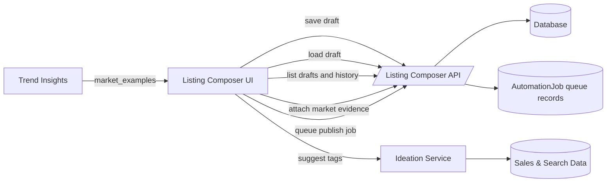

# Listing Composer Architecture

## Persisted Activity Views

The composer now renders source-backed `Draft History` and `Publish Queue`
panels from the listing composer API instead of relying only on local draft
state. Draft lists are paginated and sorted by `updated_at`, revision history is
loaded per draft, and direct `?draft={id}` links load a persisted draft into the
editor. Queue visibility is also paginated and filterable by status.

All activity payloads keep metric/source provenance fields where they cross the
API/UI boundary: `source`, `is_estimated`, `updated_at`, and `confidence`.
Credential-backed Etsy, Printify, and OpenAI flows remain non-blocking until
credentials and live publish implementations are explicitly connected.

## Market Evidence Handoff

Trend insights can hand off a source-backed `market_evidence` object into the
composer through query params. The panel shows the public source, source URL, and
optional image URL when a scraper captured one. Draft saves persist that evidence
in revision metadata so later history/export views can explain which market
example informed the variation prompts and anti-patterns.

Market evidence is not treated as generated product art. The composer labels it
as research input for original variations and warns against copying source
titles, photos, compositions, brand names, or protected references.
